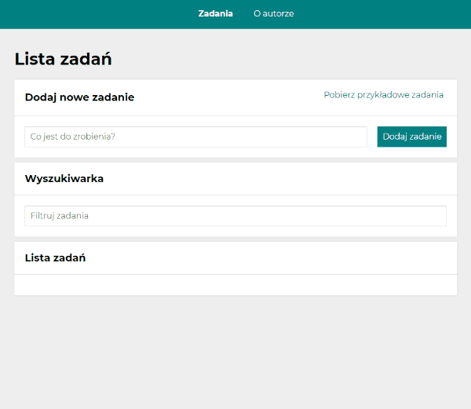

#  To-do-list 

Welcome to To-do-list!

If you are looking for a place to save your to-do list this is the place for you!

## Preview of the website 

 [Click here](https://izabelanowak.github.io/to-do-list-with-redux/) to see To-do-list demo!

## How to use
See gif below to see how to-do-list works!

## Used technologies:

-   Semantic HTML
-   CSS
-   Media queries
-   Grid
-   Flexbox
-   ES6+ features
-   Immutability
-   React
-   create-react-app
-   Webpack
-   Babel
-   Hooks (useState, useEffect useRef, useSelector, useDispatch, useHistory, useLocation)
-   localStorage
-   Styled-components
-   custom Hooks
-   Redux
-   Redux Toolkit
-   Redux-Saga
-   React Router
## Description
Here is a list of tasks.

At the very top of the page there is a navigation that allows you to navigate around the page.

Here you can add your tasks by typing the content into the text field, and then clicking the button or confirming enter! Your tasks will appear in the list below. 

With the green button you can mark your task as completed or delete it after pressing the red button. 

After entering first task, four buttons appear: *(Ukryj ukończone)*, *(Odznacz wszystkie)*, *(Ukończ wszystkie)* and *(Usuń wszystkie)*. The first one hides/shows all completed tasks, the second one marks all complete tasks as undone (button is disabled when all task are incompleted). The next one marks all incomplete tasks as completed and this button does not work when all tasks are marked as done. The last one removes all tasks on the list. 

Your tasks do not disappear after closing or refreshing the page, they are saved in localStorage!

An additional functionality is the ability to download sample tasks. You can do it by clicking on the button *(Pobierz przykładowe zadania)*. After a while (instead of the button during this time, text *(Ładowanie…)* will appear) the example tasks appear on the list!

Next feature is the search engine. Thanks to it, by entering the appropriate phrase as the search key, tasks on the to-do-list are filtered according to the key.

After clicking on the content of a specific task, the user is transferred to a subpage with detailed information about this task.

After selecting *(O autorze)* in the menu, a page with some information about the author is displayed.

Website is friendly to mobile devices.

## Getting Started with Create React App

This project was bootstrapped with [Create React App](https://github.com/facebook/create-react-app).

## Available Scripts

In the project directory, you can run:

### `npm start`

Runs the app in the development mode.\
Open [http://localhost:3000](http://localhost:3000) to view it in the browser.

The page will reload if you make edits.\
You will also see any lint errors in the console.

### `npm run build`

Builds the app for production to the `build` folder.\
It correctly bundles React in production mode and optimizes the build for the best performance.

The build is minified and the filenames include the hashes.\
Your app is ready to be deployed!

See the section about [deployment](https://facebook.github.io/create-react-app/docs/deployment) for more information.

### `npm run eject`

**Note: this is a one-way operation. Once you `eject`, you can’t go back!**

If you aren’t satisfied with the build tool and configuration choices, you can `eject` at any time. This command will remove the single build dependency from your project.

Instead, it will copy all the configuration files and the transitive dependencies (webpack, Babel, ESLint, etc) right into your project so you have full control over them. All of the commands except `eject` will still work, but they will point to the copied scripts so you can tweak them. At this point you’re on your own.

You don’t have to ever use `eject`. The curated feature set is suitable for small and middle deployments, and you shouldn’t feel obligated to use this feature. However we understand that this tool wouldn’t be useful if you couldn’t customize it when you are ready for it.