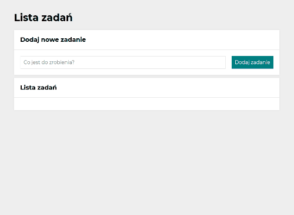
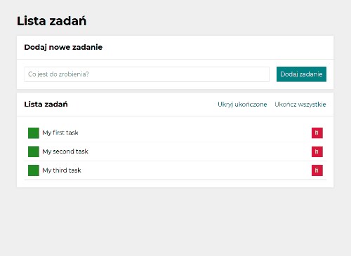
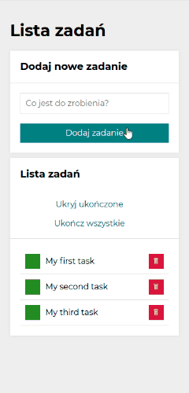

# To-do-list

Welcome to To-do-list!

If you are looking for a place to save your to-do list this is the place for you!

## Preview of the website 

=> [Click here](https://izabelanowak.github.io/to-do-list-react/) to see To-do-list demo 

## Description
Here is a simple list of tasks. Here you can add your tasks by typing the content into the text field, and then clicking the button or confirming enter! Your tasks will appear in the list below. With the green button you can mark your task as completed or delete it after pressing the red button. After entering first task, two buttons appear: (Ukryj ukończone) and (Ukończ wszystkie). The first one hides/shows all completed tasks and the second one marks all incomplete tasks as completed. The button does not work when all tasks are marked as done. Your tasks do not disappear after closing or refreshing the page, they are saved in localStorage!

## Used technologies:

-   Semantic HTML
-   CSS
-   Media queries
-   Grid
-   Flexbox
-   ES6+ features
-   Immutability
-   React
-   create-react-app
-   Webpack
-   Babel
-   Hooks (useState, useEffect)
-   localStorage
-   Styled-components
-   custom Hooks

## How to use
See gif below to see how to-do-list works!

1. Add new task by clicking into button (Dodaj zadanie) or just click enter!

2. You can set your task as done by click in green button, or remove task by clicking in red button!

3. Hide/show your completed tasks with the button (Ukryj ukończone).

4. Set all tasks complete with the button (Ukończ wszystkie).

5. See how to-do list works on phones!

## Getting Started with Create React App

This project was bootstrapped with [Create React App](https://github.com/facebook/create-react-app).

## Available Scripts

In the project directory, you can run:

### `npm start`

Runs the app in the development mode.\
Open [http://localhost:3000](http://localhost:3000) to view it in the browser.

The page will reload if you make edits.\
You will also see any lint errors in the console.

### `npm run build`

Builds the app for production to the `build` folder.\
It correctly bundles React in production mode and optimizes the build for the best performance.

The build is minified and the filenames include the hashes.\
Your app is ready to be deployed!

See the section about [deployment](https://facebook.github.io/create-react-app/docs/deployment) for more information.

### `npm run eject`

**Note: this is a one-way operation. Once you `eject`, you can’t go back!**

If you aren’t satisfied with the build tool and configuration choices, you can `eject` at any time. This command will remove the single build dependency from your project.

Instead, it will copy all the configuration files and the transitive dependencies (webpack, Babel, ESLint, etc) right into your project so you have full control over them. All of the commands except `eject` will still work, but they will point to the copied scripts so you can tweak them. At this point you’re on your own.

You don’t have to ever use `eject`. The curated feature set is suitable for small and middle deployments, and you shouldn’t feel obligated to use this feature. However we understand that this tool wouldn’t be useful if you couldn’t customize it when you are ready for it.